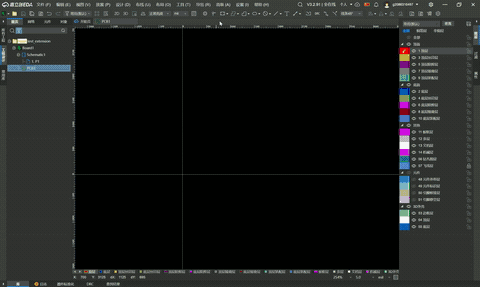

[简体中文](#) | [English](./README.en.md) | [繁體中文](./README.zh-Hant.md) | [日本語](./README.ja.md) | [Русский](./README.ru.md)

# PCB灯光画

PCB灯光画是一个用于 JLCEDA / EasyEDA 专业版的 PCB 场景插件。  
它提供从图片到 PCB 分层素材的完整处理流程，并支持在 PCB 文档内一键生成图元。

## 主要功能

- 上传图片并进行原图编辑（画笔/套索/填充）
- 基于固定调色板进行量化简化
- 生成遮罩图、图层图和实物预览图
- 单图保存与 ZIP 导出
- 一键生成 PCB 画图元（顶层/底层/阻焊/丝印等）

## 快速开始

1. 在扩展管理中安装 `build/dist/pcb-light-paint_v0.1.6.eext`
2. 打开任意 PCB 文档
3. 顶部菜单进入 `PCB灯光画 -> 打开工作台`
4. 上传图片，完成编辑与图层生成
5. 点击 `一键生成PCB画` 或导出文件

## 功能演示

> 演示内容：从图片上传、编辑分层到一键生成 PCB 图元的完整流程（v0.1.6）。

## 当前状态

- 当前版本：`0.1.6`
- 已完成稳定工作流：上传、编辑、图层生成、导出、一键生成 PCB 画
- 3D 预览边缘空白问题正在持续优化（存在实验性参数验证）
